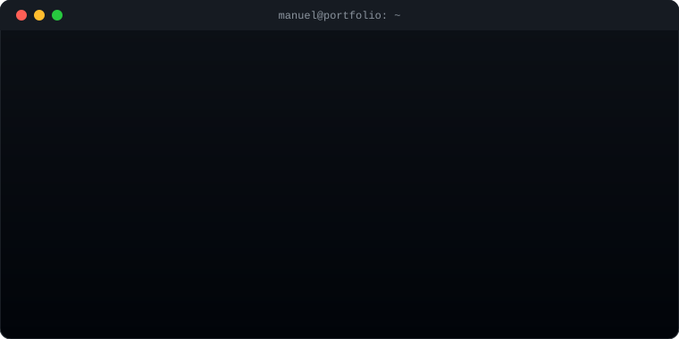

<div align="center">



<br/><br/>


</div>

<br/>

<table>
<tr>
<td width="230" valign="top">

```
  ╭──────────────╮
  │    </>       │
  │   MANUEL     │
  │   ROMERO     │
  ╰──────────────╯
```

</td>
<td valign="top">

```
manuel@romerocts
-----------------
OS         Colombia 🇨🇴 (Cesar)
Uptime     8vo semestre · Ing. Sistemas, UPC
Shell      React 19 + TypeScript + Vite
DE         Tailwind CSS · Zustand · TanStack Query
Backend    Supabase · Firebase · Node.js
Mobile     Flutter / Dart
Automation Evolution API (WhatsApp bots)
Status     open_to_work = true
```

</td>
</tr>
</table>

---

### `$ tech --stack`

```
frontend     react@19  typescript  vite  tailwindcss  zustand  tanstack-query
backend      node  supabase  firebase
mobile       flutter  dart
automation   evolution-api (whatsapp)
tooling      git  docker  postman  power-bi  vercel
```

---

### `$ ls -la projects/`

<details>
<summary><b>📁 AgentDate</b> — <code>SaaS de reservas multi-tenant</code></summary>
<br/>

Plataforma SaaS multi-tenant de agendamiento de citas con bot de WhatsApp integrado (Evolution API), calendario drag-and-drop, módulo de finanzas y un sistema de tres capas para prevenir dobles reservas.

`React 19` `TypeScript` `Vite` `Tailwind CSS` `Zustand` `TanStack Query` `Supabase`

</details>

<details>
<summary><b>📁 NutriCate</b> — <code>App móvil de nutrición con IA</code></summary>
<br/>

Aplicación móvil de nutrición potenciada por IA, con seguimiento de hábitos, análisis nutricional y metas personalizadas.

`Flutter` `Dart`

</details>

<details>
<summary><b>📁 RouteNia</b> — <code>Gestión de proyectos de software</code></summary>
<br/>

Herramienta de gestión de proyectos con tableros Kanban, bandeja de ideas, notas y exportación a Markdown/JSON.

`React 19` `TypeScript` `Vite 6` `Tailwind CSS 4`

</details>

<br/>

> `$` [ver todos los repos →](https://github.com/romerocts?tab=repositories)

---

### `$ ./stats.sh --github`

<div align="center">


<br/>


</div>

---

### `$ cat contact.json`

```json
{
  "github": "github.com/romerocts",
  "fiverr": "en construcción 🚧",
  "email": "tu_correo@email.com",
  "open_to": ["freelance", "prácticas", "proyectos junior"]
}
```

<div align="center">

<br/>


<br/><br/>

<sub><code>$ exit</code> — gracias por pasar por aquí 👋</sub>


</div>
